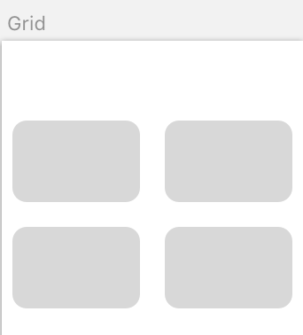

# Sketch Conventions

In order to optimize code generation from Sketch prototypes to your platform target, please adhere to the following principles and conventions.

## Add sufficient meta-data

Sketch object such as layers, groups and symbols need to have sufficient meta-data in order
for the model/code generator to understand what they really are. A simple name is not enough.

## Logical grouping

Please group layers whenever they form a cohesive unit, such as a row or column, a button etc. Then use the Group (metadata) to indicate what the underlying unit is.

### Example: Button

#### Button:Artboard

#### Button:Layer structure

* save:button (layer group)
  * label (text layer)
  * click-area (rectangle layer)

## Structural conventions

Metadata conventions for rows, columns, grids and similar structural layouts

### Example: Row

* `people:row(n)#gap(4)`
  * `person:1`
  * `person:2`

Row with 1 to 3 elements

* `people:row(1-3)`
  * `person:image(+)`
  * `person:name(+)`
  * `person:title(?)`

Validations

* `(+)` required
* `(?)` optional

Ideally for required vs optional elements there should be a Sketch layour convention.
For an optional element, use striped borders, a 50% alpha channel or both.

### Example: Column

* `people:column(n)#gap(4)`

  * `person:1`
  * `person:2`

* `people:column(1-3)`
  * `person:1`
  * `person:2`

### Example: Stack

A `stack` is a one dimensional layout controller.

### Example: Stack (vertical)

Layers stacked on top of one another in vertical direction (column)

* `people:stack(v)#gap(2)`
  * `person:1`
  * `person:2`

### Example: Stack (horizontal)

Layers stacked next to one another in horizontal direction (row)

* `people:stack(h)#gap(2)`
  * `person:1`
  * `person:2`

### Example: Grid

A `grid` is a 2 dimensional layout controller. This is similar to `stack` which is a one dimensional layout controller.

#### Grid:Artboard

#### Grid:Layer structure

* `profiles:grid(2xn)` (layer group)
  * `data:label` (text layer)
  * `trigger:click` (rectangle layer)

#### Example: Grid:variations

Use the special `none` indicator in the data position
You can be more specific by using the format `data:none` and `data:2xn`
For a grid that is flexible in both directions, use `data:nxm`, `data:?x?` or perhaps
`data:_x_`, whichever you find is a better and more clear convention (as long as it is not a number or special character `:` or `#`)

* `profiles:grid(data:none)` (layer group)
  * `no-data:label` (text layer)
* `profiles:grid(data:2xn)` (layer group)
  * ...

#### Grid:Artboard variations

### Example: List view

Use a list to indicate the use of a `ListView` widget

* `people:list(h)#gap(2)`
  * `person:1`
  * `person:2`

### Example: Scroll List view

Use a `scroll-list` to indicate the use of a `ScrollList` view widget

* `people:scroll-list(h)#gap(2)`
  * `person:1`
  * `person:2`

### Example: Menu

Use a `menu` to indicate the use of a `Menu` view widget

* `people:menu(h)#gap(2)`
  * `label:add campaign#action:add_campaign`
  * `label:campaign overview#action:list_campaigns`

A menu is simply a special kind of list view, usually with some sort of global/local navigation.

The menu items may contain meta-data to signify actions to be taken, such as `add_campaign`, which in `Redux` would mean a `dispatch(ADD_CAMPAIGN)`
